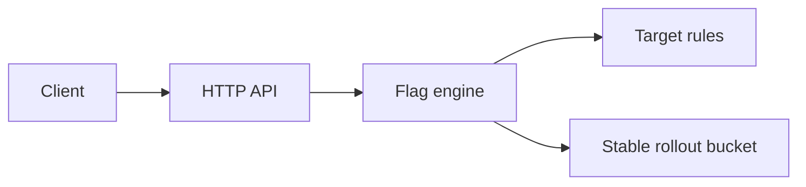

# Flagship Feature Flags

A compact Go feature-flag service demonstrating deterministic percentage rollouts, attribute targeting and an immediate kill switch. The engine is concurrency-safe and the HTTP API has no third-party runtime dependencies.

## What it demonstrates

- Stable SHA-256 bucketing: the same flag and subject always receive the same rollout decision.
- Targeting rules for equality, inequality and string prefixes.
- A global `enabled` switch that overrides rules and rollout percentages.
- Concurrent reads and updates protected by an `RWMutex`.
- Strict JSON decoding, bounded request bodies and explicit HTTP method handling.
- Unit, race and HTTP integration testing.



## Requirements

- Go 1.23 or later
- `curl` and Bash for the automated demo

No credentials, paid APIs, databases or cloud resources are required.

## Run locally

```bash
go run ./cmd/server
```

The server listens on `http://localhost:8080`. Override it with `PORT=9090 go run ./cmd/server`.

Create or replace a flag:

```bash
curl -i -X PUT http://localhost:8080/v1/flags \
  -H 'Content-Type: application/json' \
  -d '{"key":"regional-checkout","enabled":true,"rollout":100,"rules":[{"attribute":"country","operator":"eq","value":"AU"}]}'
```

Evaluate it:

```bash
curl -s -X POST http://localhost:8080/v1/evaluate \
  -H 'Content-Type: application/json' \
  -d '{"key":"regional-checkout","subject":"user-42","context":{"country":"AU"}}'
```

## Reproducible demo

The demo builds an isolated binary, starts it on port `18080`, creates flags and verifies targeting, deterministic rollout and kill-switch behaviour:

```bash
./demo.sh
```

Use another port with `PORT=18081 ./demo.sh`.

## Verify

```bash
gofmt -w cmd internal
go vet ./...
go test -race ./...
go build -buildvcs=false ./cmd/server
./demo.sh
```

## API

| Method | Path | Purpose |
| --- | --- | --- |
| `GET` | `/health` | Liveness response |
| `GET` | `/v1/flags` | List the current in-memory flags |
| `PUT` | `/v1/flags` | Create or replace a flag |
| `POST` | `/v1/evaluate` | Evaluate a flag for a subject and context |

A flag has a key, an `enabled` kill switch, a rollout from 0–100 and optional rules. Every rule must match before rollout is considered. Unknown or disabled flags evaluate to `false`.

## Limitations

This is a portfolio/reference implementation, not a production deployment:

- State is process-local and disappears on restart; there is no database or cross-instance synchronization.
- Administrative writes and evaluations have no authentication, authorization or audit log.
- There is no SDK, streaming update channel, metrics backend or distributed cache.
- SHA-256 bucketing provides deterministic allocation, not cryptographic access control.
- Docker configuration is included but was not required for the local release checks.
- No hosted service, cloud deployment, load test or production scale claim is made.

## Licence

MIT — see [LICENSE](LICENSE).
