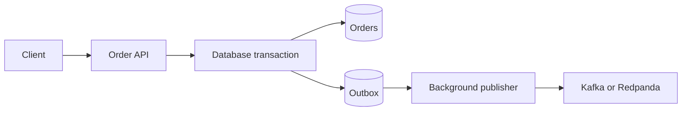

# OrderMesh

OrderMesh is a Java 17 and Spring Boot order service demonstrating idempotent writes and the transactional outbox pattern. An order and its integration event are committed in one database transaction; a background publisher then forwards unpublished events to a Kafka-compatible broker.



## Features

- Idempotent order creation using the required `Idempotency-Key` header.
- JPA persistence with a unique database constraint on idempotency keys.
- Order and outbox-event writes inside one Spring transaction.
- Scheduled, bounded outbox batches sent through Spring Kafka.
- H2 demo profile for credential-free local execution.
- PostgreSQL and Redpanda configuration for local infrastructure exploration.
- Focused service and HTTP integration tests.

## Requirements

- Java 17 or later
- Maven 3.9 or later
- Bash and `curl` for the automated demo

The default demo needs no credentials, paid API, PostgreSQL, Kafka or cloud account.

## Quick demo

```bash
./demo.sh
```

The script packages the application, starts it with an in-memory H2 database on port `18081`, creates an order, verifies an idempotent retry, fetches the order and confirms that reusing the key for different data is rejected. Override the port with `PORT=18082 ./demo.sh`.

## Run manually with H2

```bash
mvn -B package
java -jar target/ordermesh-1.0.0.jar --spring.profiles.active=demo
```

Create an order:

```bash
curl -i -X POST http://localhost:8080/v1/orders \
  -H 'Content-Type: application/json' \
  -H 'Idempotency-Key: order-request-1' \
  -d '{"customerId":"customer-42","amount":19.99}'
```

Repeat the same request with the same key to receive the existing order without creating another outbox event. Fetch the returned order using `GET /v1/orders/{id}`.

## Tests

```bash
mvn -B verify
```

The test suite covers service-level order/outbox creation, retry deduplication, H2 persistence, order lookup, invalid amounts and conflicting key reuse.

## Optional PostgreSQL and Redpanda stack

```bash
docker compose up --build
```

The application reads `DB_URL`, `DB_USER`, `DB_PASSWORD` and `KAFKA_BOOTSTRAP`. This path demonstrates the intended infrastructure wiring; the release checks use the self-contained H2 profile instead.

## Delivery semantics and limitations

This is a portfolio/reference implementation, not a production deployment:

- The default demo uses process-local H2 data that disappears when the process stops.
- The API has no authentication, authorization, rate limiting or audit log.
- Outbox publishing is at-least-once. A broker acknowledgement followed by a database rollback can cause a duplicate delivery, so consumers must be idempotent.
- The publisher uses a fixed topic and a simple polling loop; it has no dead-letter policy, retry backoff, partition-management tooling or observability backend.
- Concurrent first writes using the same idempotency key are protected by the database constraint but can return a conflict requiring a retry.
- PostgreSQL/Redpanda and Docker execution were not part of the local release checks, and no cloud deployment or production-scale result is claimed.

## Licence

MIT — see [LICENSE](LICENSE).
