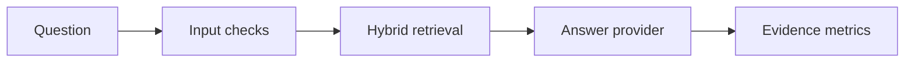

# RAGGuard

RAGGuard is an offline-first reference gateway for testing the engineering around retrieval-augmented generation (RAG): deterministic retrieval, input guardrails, cited evidence and lightweight answer evaluation. It runs without an API key or network service.



## What it demonstrates

- A FastAPI API with health and query endpoints.
- BM25-style lexical ranking combined with a deterministic hashed-token vector score.
- Heuristic checks for common prompt-injection phrases and sensitive number patterns.
- Citation coverage and grounded-token-overlap measurements.
- An evidence-only generator for deterministic, credential-free local use and CI.
- An optional chat-completions-compatible HTTP provider selected through environment variables.

## Requirements

- Python 3.11 or newer.

## Install

Create and activate a virtual environment, then choose one of these installs:

```bash
python -m venv .venv
source .venv/bin/activate

# Reproduce the checked release environment exactly.
python -m pip install -r requirements-dev.lock
python -m pip install --no-deps -e .

# Or resolve versions within the declared compatibility ranges.
# python -m pip install -e '.[dev]'
```

## Run the API

No environment variables are needed for the offline mode:

```bash
uvicorn ragguard.api:app --host 127.0.0.1 --port 8000
```

In another terminal:

```bash
curl http://127.0.0.1:8000/health
curl -X POST http://127.0.0.1:8000/v1/query \
  -H 'content-type: application/json' \
  -d '{"question":"How does retrieval support RAG evaluation?"}'
```

Interactive OpenAPI documentation is available at `http://127.0.0.1:8000/docs` while the server is running.

## Reproducible local demo

The demo starts a real HTTP server on an available loopback port, checks health, submits an offline query, verifies its citations and confirms that a prompt-injection attempt is blocked. It removes any provider settings from the child process, so no credentials or paid service are used.

```bash
python demo.py
```

## Checks

```bash
ruff check .
ruff format --check .
pytest -q
python demo.py
```

## Optional model provider

Copy `.env.example` and export all three values below to use a chat-completions-compatible endpoint:

- `LLM_API_BASE` — base URL before `/chat/completions`.
- `LLM_API_KEY` — bearer token.
- `LLM_MODEL` — provider model identifier.

If any value is absent, the gateway stays in local evidence-only mode. The optional provider path is implemented but is not exercised by the credential-free release checks.

## Scope and limitations

This is a portfolio/reference implementation, not a deployed service. Its three example documents and all state are held in process memory. It has no authentication, persistence, tenant isolation, rate limits or production telemetry. The hashed-token vector is deterministic and dependency-free, but it is not a learned semantic embedding and can collide. Guardrails use a small regex/phrase set and cannot guarantee prompt-injection or personal-data detection. The evaluation metrics are simple citation and token-overlap signals, not proof of factual correctness. Docker packaging is included, but no container registry, cloud deployment, infrastructure load test or hosted demo is claimed.

## Licence

MIT. See [LICENSE](LICENSE).
